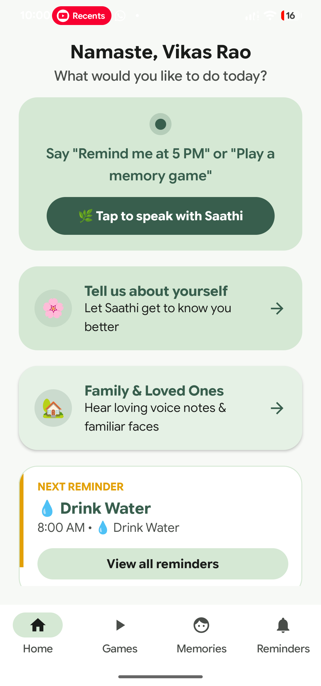
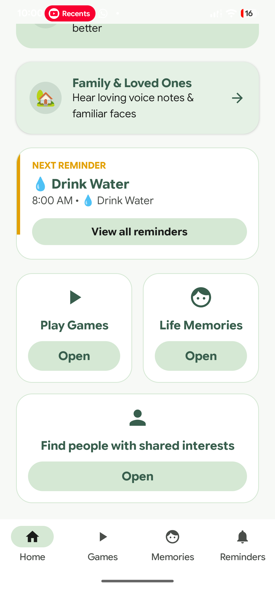
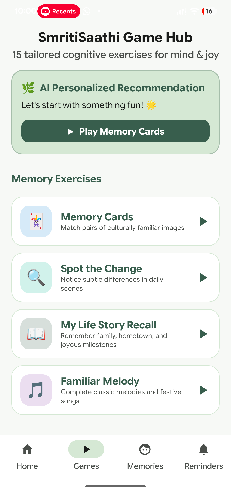
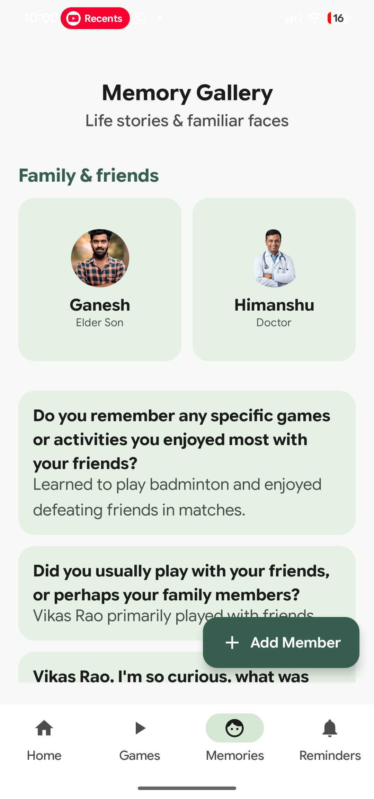
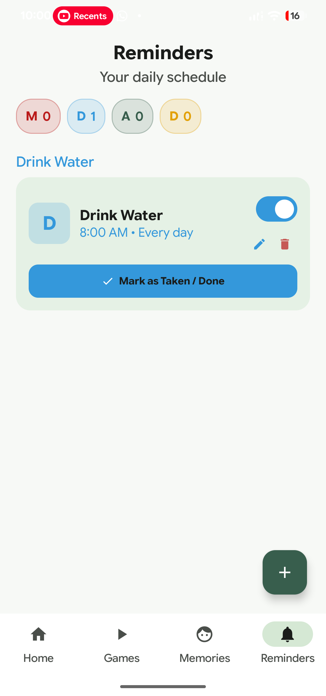
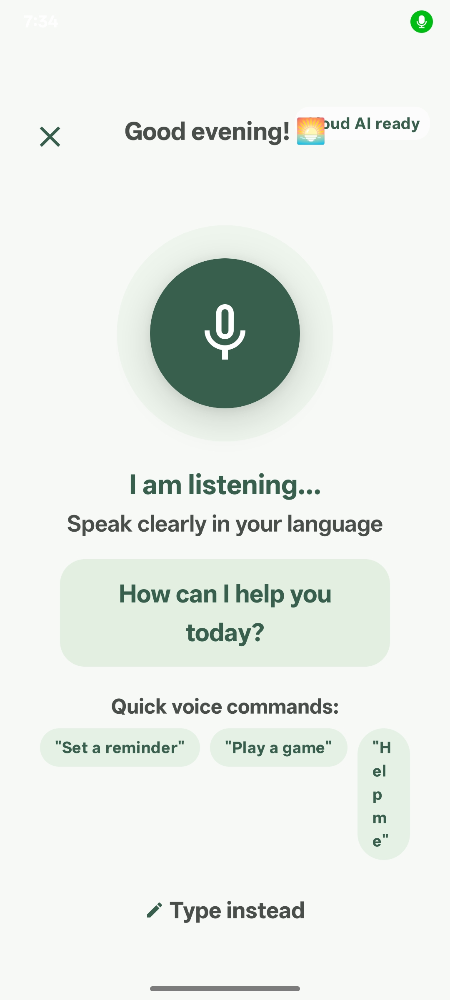
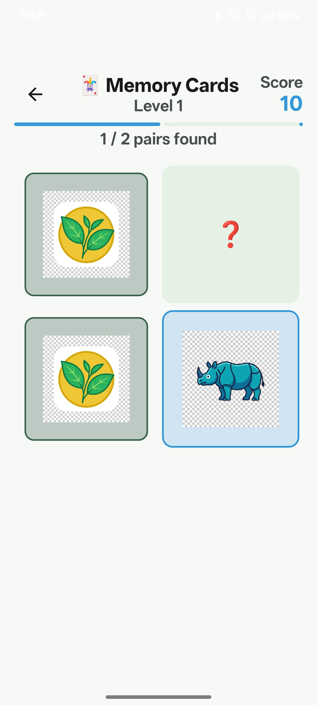
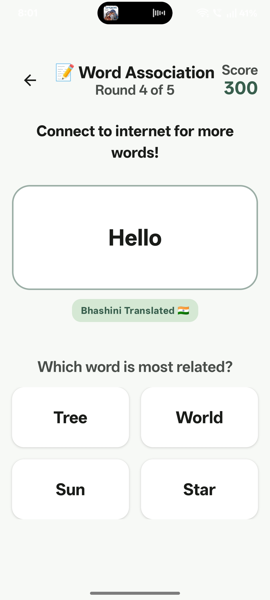

# 🧠 SmritiSaathi (स्मृति साथी)

> **Empowering Cognitive Care, Cherished Memories, and Daily Independence**

SmritiSaathi is a personalized, AI-driven cognitive companion Android application specifically tailored for individuals experiencing memory challenges, early-stage dementia, or cognitive decline. Built with culturally resonant Indian contexts, multilingual voice support via Bhashini, and powered by Google Gemini and on-device Google AI Edge (LiteRT).

---

## 📱 App Screenshots

<p align="center">
  
  
  
  
</p>

<p align="center">
  
  
  
  
</p>

---

## ✨ Key Features

### 🎙️ 1. Intelligent Multilingual Voice Companion ("Saathi")
- **Conversational Support**: Natural dialogue for reassurance, memory orientation, and helpful companionship.
- **Multilingual Powered by Bhashini**: Native Indian language understanding and synthesis.
- **Dual AI Engine**: Online Google Gemini AI model with offline-capable on-device Google AI Edge (LiteRT Gemma) fallback.

### 🧩 2. Cognitive Exercise Hub (15+ Tailored Games)
- **Memory Cards**: Culturally familiar imagery matching (Hornbill, Assam tea, bamboo, rhinos, etc.).
- **Word Association & Sequence Recall**: Language association quizzes with instant Bhashini translations.
- **Daily Routine & Pattern Matching**: Enhancing spatial awareness and daily life habit retention.
- **AI Personalized Recommendations**: Adaptive difficulty and activity suggestions tailored to patient performance.

### 🖼️ 3. Memory Gallery & Life Story Archive
- **Family & Loved Ones**: Grid of familiar faces with real voice playback notes.
- **Life Story Prompts**: Captures personal anecdotes, favourite places, and milestone memories.
- **Add Loved One**: Direct photo picker integration and real voice note recording.

### ⏰ 4. Daily Schedule & Smart Reminders
- **Categorized Daily Care**: Water, medications, meals, appointments, and activities.
- **Elder-Friendly Design**: Big action buttons, audio confirmations, and single-tap mark-as-done.

### 👨‍⚕️ 5. Caregiver Portal & Monitoring
- **PIN-Protected Caregiver Zone**: Secure configuration and patient mood tracking.
- **Cognitive Trend Analytics**: Comprehensive progression tracking powered by Vico Charts.

---

## 🚀 Release APK

The signed release APK is available directly in this repository:
- 📦 **[`app-release.apk`](app-release.apk)** (Version 1.0.0)

### Quick Install Instructions:
1. Download **`app-release.apk`** to your Android device (Android 8.0 / API 26+).
2. Enable *Install from unknown sources* if prompted.
3. Tap the file to install and open **SmritiSaathi**.

---

## 🛠️ Architecture & Tech Stack

- **UI Framework**: Modern Jetpack Compose with Material 3 design system.
- **Architecture**: Clean Architecture + MVVM (Model-View-ViewModel) + Single Source of Truth (SSOT).
- **Dependency Injection**: Dagger Hilt.
- **Local Persistence**: Room Database encrypted with SQLCipher & DataStore Preferences.
- **AI / ML**:
  - Google Gemini API (`generativeai`)
  - Google AI Edge / MediaPipe Tasks GenAI (LiteRT Gemma)
  - Bhashini Translation & TTS/ASR APIs
- **Asynchronous Execution**: Kotlin Coroutines & Flow, WorkManager.
- **Media**: Android MediaRecorder & MediaPlayer for voice audio playback.
- **Charts**: Vico Charts for Jetpack Compose.
- **Image Loading**: Coil Compose.
- **Animations**: Airbnb Lottie for Compose.

---

## 💻 Building From Source

```bash
# Clone the repository
git clone https://github.com/lakshayverma2610/SMRITISAATHI.git
cd SMRITISAATHI

# Build the debug APK
./gradlew assembleDebug

# Build the release APK
./gradlew assembleRelease
```

---

## 📄 License
This project is developed for cognitive care and assistive health solutions. All rights reserved.
