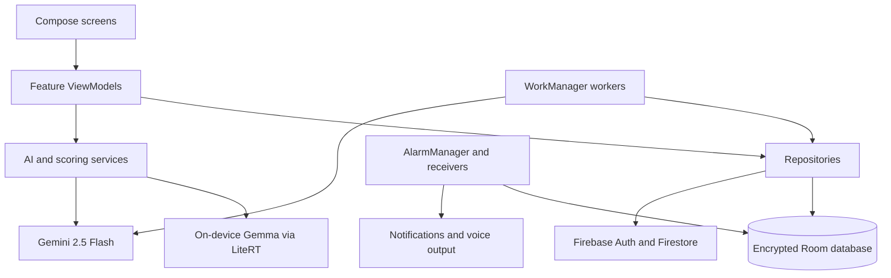

# Application architecture

SmritiSaathi is a native Android application for patients experiencing memory
challenges and for the caregivers who support them. It is implemented in Kotlin
with Jetpack Compose and follows an MVVM-style, offline-first architecture.

## Technology stack

| Area | Implementation |
| --- | --- |
| UI | Jetpack Compose and Material 3 |
| Navigation | Navigation Compose |
| State management | ViewModels, Kotlin coroutines, `StateFlow`, and `Flow` |
| Dependency injection | Dagger Hilt |
| Local persistence | Room with SQLCipher |
| Session persistence | Preferences DataStore |
| Cloud services | Firebase Authentication, Firestore, and Analytics |
| Background work | WorkManager |
| Scheduled reminders | AlarmManager, broadcast receivers, notifications, and TTS |
| AI | Gemini 2.5 Flash, MediaPipe LLM Inference/LiteRT, and deterministic fallbacks |
| Language services | Android speech APIs and Bhashini APIs |
| Media | Android MediaRecorder, MediaPlayer, TextToSpeech, and Coil |
| Charts | Vico Compose |

The application supports Android API 26 and later, targets API 35, and uses
Java 17 bytecode.

## Source layout

The application code is under
`app/src/main/java/com/nercare/cogcare` and is divided by responsibility:

```text
com.nercare.cogcare/
├── ai/             AI engines, parsing, scoring, and adaptive difficulty
├── data/
│   ├── local/      Room database, entities, and DAOs
│   ├── remote/     Firestore access
│   └── repository/ Domain-facing data operations
├── di/             Hilt provider modules
├── domain/model/   Application domain models and catalogs
├── presentation/   Compose screens and ViewModels grouped by feature
├── reminder/       Alarm scheduling, notifications, and voice reminders
├── sync/           Periodic Firestore and game-content synchronization
├── util/           Connectivity monitoring
└── voice/          Android speech recognition and TTS helper
```

## Runtime layers



Compose screens observe immutable UI state exposed by their ViewModels.
ViewModels coordinate repositories and domain services. Repositories convert
between Room entities, Firestore documents, and domain models.

## User journeys

### Caregiver journey

1. The caregiver signs in or creates an account through Firebase Authentication.
2. The caregiver selects an existing patient or completes patient onboarding.
3. Onboarding saves the profile and password verifier locally and creates the
   patient record and username reservation in Firestore.
4. The caregiver dashboard derives cognitive scores and trends from recorded
   game sessions.
5. The caregiver can edit the profile, manage life-story context, reset the
   local patient password, and review overdue reminders.

### Patient journey

1. The patient signs in with a username and password stored on the device.
2. The home screen combines the patient profile, reminders, life-story data,
   recent performance, and an adaptive activity recommendation.
3. The patient can play cognitive games, talk to Saathi, review memories and
   family members, manage reminders, or discover shared-interest matches.
4. Game results are written locally first and synchronized to Firestore when a
   connection is available.

## Feature modules

The game hub exposes 15 activities in five cognitive domains. Memory Cards,
Word Association, Daily Routine, Sequence Recall, and Pattern Matching use
dedicated engines. The remaining activities use the generic personalized quiz
screen and draw from built-in and patient-specific questions.

The voice companion has a default assistant mode and a life-story mode. The
default mode can converse, create reminders, open games, provide reassurance,
and save requested memories. Life-story mode asks personalized reminiscence
questions and stores responses as verified patient memories.

Reminders are stored in Room and scheduled as exact alarms. A broadcast
receiver displays the notification, starts voice playback through WorkManager,
and rearms the next occurrence. A boot receiver restores scheduling after a
device restart.

## Application startup

`MainActivity` hosts the Compose navigation graph. The splash ViewModel reads
the saved DataStore session and Firebase authentication state, then routes to
the patient home, caregiver patient list, or role-selection screen. It also
attempts a legacy model download; the configured download URL is currently a
placeholder and is not the Gemma model used by the voice companion.

## Current architectural limitations

- Patient login credentials, reminders, family records, recordings, and
  life-story memories are local to one device.
- The caregiver PIN screen is not part of the normal caregiver navigation path.
- Most UI strings are embedded directly in Compose code, limiting the effect of
  the existing Assamese and Bengali resource files.
- `fallbackToDestructiveMigration()` can erase local data when no explicit Room
  migration exists.
- Automated tests currently cover only AI response parsing.

