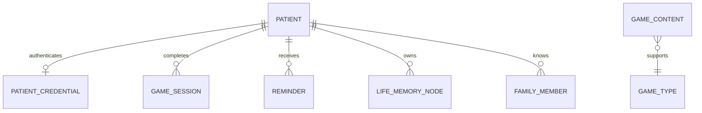

# Database

SmritiSaathi uses Room as its local source of truth and SQLCipher to encrypt the
database file. The database is named `cogcare_db`, currently uses schema version
7, and contains seven entities.

## Entity overview

| Table/entity | Purpose | Primary ownership key |
| --- | --- | --- |
| `PatientEntity` | Identity, caregiver linkage, preferences, medical context, and care profile | Patient ID |
| `PatientCredentialEntity` | Salted local patient password verifier | Patient ID |
| `GameSessionEntity` | Completed game results, accuracy, timing, difficulty, and sync state | Session ID and patient ID |
| `ReminderEntity` | Reminder type, schedule, recurrence, activation, and acknowledgement | Reminder ID and patient ID |
| `LifeMemoryNodeEntity` | Caregiver- or patient-provided life-story facts and verification metadata | Node ID and patient ID |
| `FamilyMemberEntity` | Family/friend identity, relationship, photo, and voice-note references | Member ID and patient ID |
| `GameContentEntity` | Cached generated game content and consumption state | Content ID and game type |

DAOs expose suspend operations for one-time work and `Flow` for observable UI
state. Repository classes translate Room entities into domain models so that
Compose screens and ViewModels do not depend directly on persistence types.

## Relationships

Patient deletion is coordinated in `PatientRepository`. It removes the cloud
patient data and then deletes local credentials, memories, family members, game
sessions, reminders, and the patient record.

## Repository responsibilities

### PatientRepository

- observes and updates patient profiles;
- generates human-readable patient IDs;
- reserves normalized usernames through Firestore;
- creates and verifies local PBKDF2 password records;
- builds public social-matching profiles; and
- performs cascading patient deletion.

### GameRepository

- writes completed sessions locally;
- exposes recent and patient-specific session history;
- uploads unsynchronized sessions; and
- imports remote session history when requested.

### ReminderRepository

- observes active or all patient reminders;
- creates, updates, activates, acknowledges, and deletes reminders; and
- leaves alarm registration to `ReminderScheduler`.

### LifeStoryRepository

- stores memory nodes and caregiver onboarding context;
- stores family/friend records;
- updates photo and voice-note references; and
- supplies data to the gallery, companion, personalized games, and matching.

### SessionRepository

Login role and the active patient ID are stored separately in Preferences
DataStore. This state determines splash-screen routing and is not part of the
Room schema.

## Encryption

Room is opened through SQLCipher's `SupportFactory`. The current passphrase is
a hardcoded application constant. This protects the file from casual direct
inspection but does not provide production-grade key protection because the
same secret can be recovered from every APK.

The production design should create a random database key per installation,
wrap it with Android Keystore, and include a tested migration from the existing
key. Avoid deleting or silently recreating the database if key recovery fails.

## Migrations

The database declares a 6-to-7 migration. It adds address, blood group,
allergies, doctor, mobility, communication, routine, and sleep fields to the
patient table, then creates a unique username index.

Room is also configured with `fallbackToDestructiveMigration()`. If an upgrade
does not have a registered migration path, Room can delete all local tables and
recreate them. This is especially risky because several important data types
have no cloud copy.

For every release:

1. export and commit Room schemas;
2. write explicit forward migrations;
3. test migration from every supported production version;
4. verify indexes, defaults, and foreign-key behavior; and
5. remove destructive fallback from production builds.

## Cloud persistence boundary

| Data | Room | Firestore |
| --- | --- | --- |
| Patient profile | Yes | Yes |
| Patient credential verifier | Yes | No |
| Game sessions | Yes | Yes |
| Public matching profile | Derived locally | Yes |
| Reminders | Yes | No |
| Life-story memories | Yes | No |
| Family members | Yes | No |
| Voice recordings | Local file reference | No |
| Generated game cache | Yes | No |

Firestore's own persistent cache is enabled, but it is separate from Room and
must not be treated as the authoritative local database.

## Data integrity considerations

- Username uniqueness is enforced locally with a Room index and remotely with
  a transactional username-reservation document.
- Room entities reference patients by ID, but deletion consistency is handled
  explicitly by repository code rather than relying solely on database-level
  cascading.
- Reminder scheduling is external state. Updating or deleting a Room reminder
  must also update its AlarmManager registration.
- Photo and voice-note columns contain URIs or file references; deleting the
  database record may require separate file cleanup.
- Multi-device conflict resolution and version metadata are not implemented.

## Backup behavior

Android backup configuration excludes `cogcare_db` and shared preferences from
cloud backup and device transfer. This reduces unintended disclosure but means
local-only records cannot be restored after reinstall, app-data clearing, or a
device replacement.

